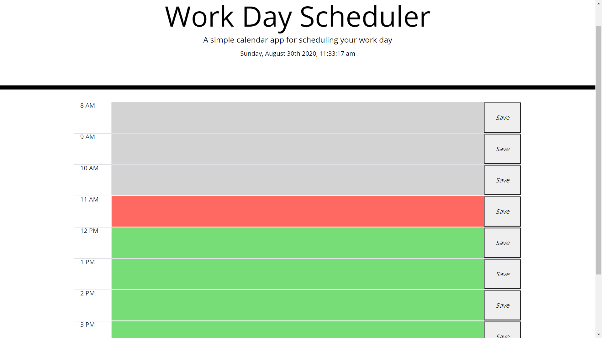

# Workday Scheduler

## *This is an application that allows the user to store and save their tasks for their day.*
  * Allows user to keep track of time.
  * Greyed out areas indicate that time slot has already passed.
  * Red areas indicate the current hour.
  * Green areas indicate the future time slots.
### Made using:
  * HTML
  * Moment.js
  * Javascript
  * Bootstrap
  * CSS
  * JQuery

Link to live site:
  * https://cdehek.github.io/workday-scheduler
  
  
  
Made with ❤️ by Christian Dehek
